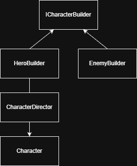

# KPZ_Lab2
Лабораторна робота №2
Дисципліна: КПЗ
Виконав: Політун Владислав
Група: ІПЗ-24-3
## Реалізовані шаблони проєктування
### Factory Method
Створення різних типів підписок для відеопровайдера:
- DomesticSubscription
- EducationalSubscription
- PremiumSubscription
Способи створення:
- WebSite
- MobileApp
- ManagerCall
### Abstract Factory
Фабрика створення техніки для різних брендів:
- IProne
- Xiaomi
- Balaxy
Типи пристроїв:
- Laptop
- Smartphone
- Netbook
- EBook
### Singleton
Клас Authenticator реалізований як єдиний екземпляр.
### Prototype
Клас Virus підтримує глибоке клонування разом з дочірніми об'єктами.
### Builder
Створення персонажів гри за допомогою:
- HeroBuilder
- EnemyBuilder
- CharacterDirector
## Діаграма

